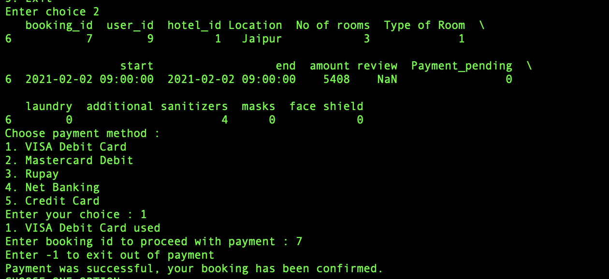

# Hotel-Manangement

## Project Overview

This project is done as a part of `Object Oriented Programming and Design` Course.

Hotel Management Project implemented using [Structured Programming](Hotel-management-structured-programming) and [Object Oriented Programming](Hotel-management-oops). 

The following features are included:- 
1. Login / Signup 
2. Booking 
3. Payment 
4. Cancellation 
5. Logout 

## Screenshots

                                        Fig 1. Main Menu 
   

                                         

                                        Fig 2. Login 
   

   

                                           Fig 3. Signup  
   

   

                                           Fig 4. Booking  
                                           
   

   

   
    

   
    
   

                                           Fig 5. Payment 
   

   

                                          Fig 6. Cancellation  
   

   

   

## Project Team Members

1. Akanksha Shrimal
2. Ravi Rathee 